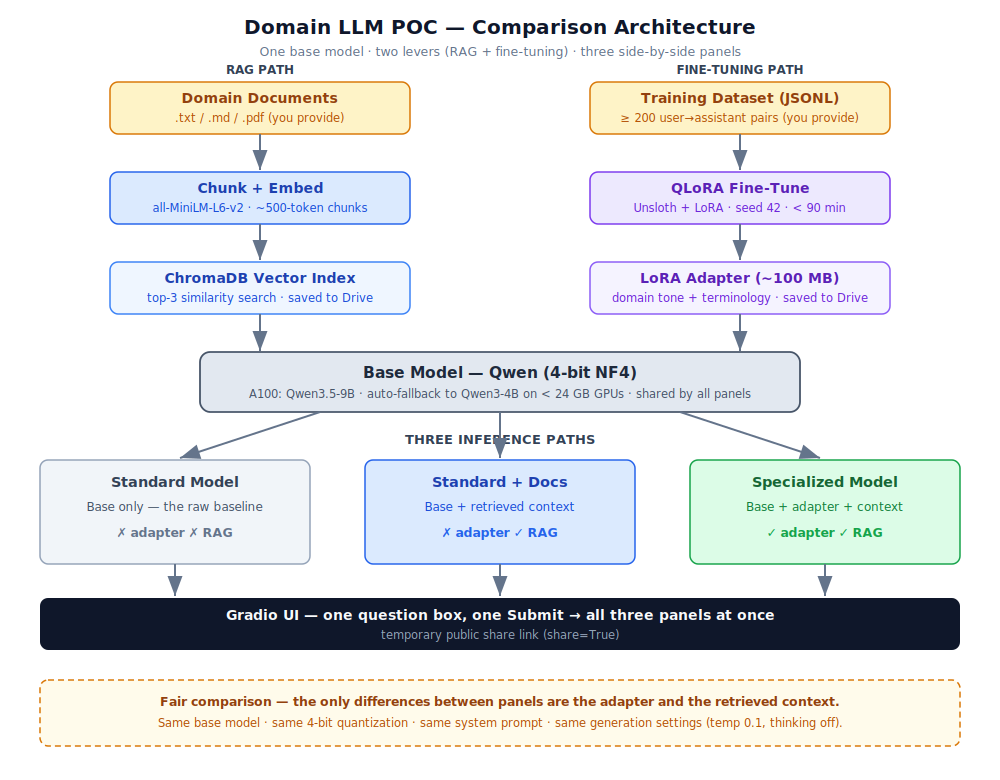

# Laytime Calculation — Domain-Specialized AI Assistant POC

A Google Colab notebook pipeline that fine-tunes a small, **free open-weight** language model on
laytime and voyage charterparty expertise, then serves a Gradio UI comparing three variants of the
same base model side by side. Anyone — no ML background needed — can ask a question about NOR
validity, SHEX clauses, SOF analysis, or demurrage calculation and judge the difference with their
own eyes.

> **Domain**: Laytime calculation · NOR validity · SHEX/SHINC/WWD · SOF analysis · WIBON/WICCON/WIFPON · BIMCO charter party forms  
> **Status**: POC · **Cost**: $0 beyond an existing Google Colab Pro+ subscription · **Runs as four phase notebooks** sharing one `config.py`, persisting to Google Drive.



---

## What it does

General models answer domain questions poorly: they don't know your internal clauses, can't reason
through the NOR→turn-time→laytime commencement sequence, and don't speak the terminology
practitioners use (WWDSHEX EIU, WIPON, ATDNSHINC). This POC pulls **two independent levers** on
top of one base model and compares the results:

| Panel | Base model | Fine-tune (LoRA) | RAG (retrieval) | Shows |
|---|:---:|:---:|:---:|---|
| **Standard Model** | ✓ | ✗ | ✗ | the raw baseline |
| **Standard + Docs** | ✓ | ✗ | ✓ | what document retrieval adds |
| **Specialized Model** | ✓ | ✓ | ✓ | the full combination |

Reading the panels left-to-right makes the improvement **attributable**: Standard → Standard+Docs is
RAG's contribution; Standard+Docs → Specialized is the fine-tuned adapter's added value.

---

## Quick start (Google Colab)

The pipeline is four **phase notebooks** that hand off through Google Drive and share one `config.py`.
Run them **in order** on an **A100** runtime (they auto-fall back to a smaller model on L4/T4).
Authorize the Drive mount when prompted; each notebook installs only its own phase's dependencies.

1. **`01_build_index.ipynb`** — upload `domain_docs/` (from this repo) → `/content/domain_docs/`, **Run all** → builds `chroma_index/` on Drive.
2. **`02_finetune.ipynb`** — upload `training_dataset.jsonl` (from this repo) → `/content/`, **Run all** → trains `lora_adapter/` on Drive.
3. **`03_compare_serve.ipynb`** — **Run all** → reloads both artifacts and prints a **public Gradio share link**; type a laytime question and compare the three panels.
4. *(optional)* **`04_export_gguf.ipynb`** — **Run all** → exports a merged GGUF for local inference.

Full validation walkthrough with expected outputs and checkpoints:
[`specs/001-domain-ai-poc/quickstart.md`](specs/001-domain-ai-poc/quickstart.md).

**Total run time**: ~25–75 min on A100 (dominated by fine-tuning). No streaming — panels fill in at
once when generation completes.

---

## Inputs included in this repo

The domain training inputs are pre-built for the **laytime calculation** domain and checked into the
repository — no authoring needed to run the demo.

### Domain documents (`domain_docs/`)

Five reference documents used by the RAG pipeline (Stage 4 / `01_build_index.ipynb`):

| File | Covers |
|---|---|
| `01_laytime_fundamentals.md` | Core concepts: laytime, demurrage, despatch, port vs berth charterparties, the arrived-ship test |
| `02_nor_and_arrival.md` | NOR requirements, WIBON / WICCON / WIFPON, NOR effectiveness, sequence from arrival to laytime commencement |
| `03_laytime_clauses_and_exceptions.md` | SHINC, SHEX EIU/UU, ATDNSHINC, WWD, WWDSHEX, turn time, inward passage, risk allocation for exceptions |
| `04_sof_analysis_guide.md` | Step-by-step SOF analysis: checking NOR validity, laytime commencement, SHEX periods, weather stoppages, disputed entries |
| `05_bimco_templates_standard_forms_and_rider_clauses.md` | GENCON 94, ASBATANKVOY, NORGRAIN, SYNACOMEX, rider clause rules, recap vs printed form conflicts |

### Training dataset (`training_dataset.jsonl`)

200 expert-level Q&A pairs covering:

- NOR validity and the WIBON / WICCON / WIFPON clause string
- Laytime commencement — turn time, office hours, SHEX restrictions on start
- SHINC / SHEX EIU / SHEX UU / ATDNSHINC — definitions and practical application
- Weather Working Days (WWD) — what stops the clock and what doesn't
- SOF analysis — the full decision sequence for each time interval
- Demurrage and despatch — calculation, "once on demurrage always on demurrage", time bars
- BIMCO charter party forms and rider clause priority rules
- Practical calculation scenarios and edge cases

Format: one JSON object per line; each has a `messages` array with exactly one `user` turn and one
`assistant` turn. See [`data/training_format_example.jsonl`](data/training_format_example.jsonl)
for the format spec.

### Demo questions (`data/demo_questions.md`)

Seven domain-specific questions designed to expose the quality gap between the three panels:

- NOR commencement timing under WIBON with WWDSHEX EIU and a 12-hour turn time
- The full SOF analysis sequence — step-by-step decision logic for each time interval
- Rider clause vs printed GENCON clause conflict (WIBON + WIFPON rider on a berth charterparty)
- WWDSHEX UU interaction with a rain stoppage on a Sunday
- Rain recorded in SOF but operations not stopped — does the time count?
- SHEX EIU vs SHEX UU — definitions and which is more favorable to charterers
- The practical meaning of "WIBON WICCON WIFPON" appearing together in a rider

Plus two general sanity-check questions (capital of France, neural network explanation) to verify
no catastrophic forgetting.

---

## How it works (in brief)

`01 Build Index` → `02 Fine-Tune` → `03 Compare & Serve` → *(optional)* `04 GGUF Export`

Each notebook re-loads what it needs from Drive artifacts (`chroma_index/`, `lora_adapter/`) —
nothing is passed in memory between phases, so any phase can be re-run independently.

- **Fine-tuning** trains a small **LoRA adapter** (QLoRA on a 4-bit base) from the 200-pair
  laytime training dataset — a ~100 MB file, not a retrained model.
- **RAG** chunks and embeds the five domain documents into an in-process **ChromaDB** index, then
  retrieves the top-3 most relevant chunks and prepends them to each question.
- **Fair comparison** is enforced: every panel uses the same base model, quantization, system
  prompt, and generation settings — the *only* differences are the adapter and the retrieved
  context.

Full narrative: [`docs/how_it_works.md`](docs/how_it_works.md).

---

## Configuration defaults

| Base model | Quantization | LoRA | Chunking | Retrieval | Generation |
|---|---|---|---|---|---|
| Qwen3.5-0.8B (A100) / Qwen3-4B (T4 fallback) | 4-bit NF4 | r=32, α=32, targets q/k/v/o | 2000 chars / 200 overlap | top-3, cosine | temp 0.1, top-p 0.9, 512 tokens, thinking off |

All values live in the shared **`config.py`** and are documented in
[`specs/001-domain-ai-poc/data-model.md`](specs/001-domain-ai-poc/data-model.md). Each
model-loading notebook auto-detects GPU VRAM via `config.select_profile()` and switches to the T4
fallback config when VRAM < 24 GB.

---

## Repository layout

```text
config.py                      # single shared module: all constants + GPU profile selection
01_build_index.ipynb           # phase 1 — build the RAG index → chroma_index/
02_finetune.ipynb              # phase 2 — QLoRA fine-tune → lora_adapter/
03_compare_serve.ipynb         # phase 3 — reload artifacts + serve the three-panel Gradio demo
04_export_gguf.ipynb           # phase 4 (optional) — merge + export → gguf_export/
notebook.ipynb                 # original single-notebook pipeline (reference)
training_dataset.jsonl         # 200 laytime Q&A pairs for fine-tuning

domain_docs/                   # five laytime reference documents for the RAG index
├── 01_laytime_fundamentals.md
├── 02_nor_and_arrival.md
├── 03_laytime_clauses_and_exceptions.md
├── 04_sof_analysis_guide.md
└── 05_bimco_templates_standard_forms_and_rider_clauses.md

data/
├── demo_questions.md          # 7 laytime domain questions + 2 sanity checks for the live demo
└── training_format_example.jsonl  # JSONL format reference

docs/
├── quick_reference.md         # one-page cheat sheet
├── how_it_works.md            # stage-by-stage narrative
├── approach_comparison.md     # fine-tuning vs RAG trade-offs
├── architecture.svg           # diagram used at the top of this README
└── findings_template.md       # post-demo results template

specs/                         # speckit feature specifications and implementation plans
└── 001-domain-ai-poc/         #   spec · plan · quickstart · contracts · data-model
.specify/memory/constitution.md  # non-negotiable project constraints
```

---

## Reproducibility & resilience

- **Per-notebook pinned dependencies** plus a **Drive-cached wheelhouse** → identical installs across sessions.
- **Fixed random seed** (`42`) across Python, NumPy, and PyTorch.
- **All artifacts persist to Drive** (`MyDrive/domain-llm-poc/`) — a Colab disconnect never loses the adapter or index.
- **Skip / rebuild prompts** on the expensive stages let a re-run reuse existing work by default; set `UNATTENDED_DEFAULT` for hands-off runs.

---

## Constraints (by design)

This project is governed by a ratified [constitution](.specify/memory/constitution.md). In short:

- **Open-weight models and free OSS only** — no paid APIs, no licensing fees.
- **Simplicity first** — four phase notebooks sharing one `config.py`, in-process ChromaDB, Gradio only, no orchestration frameworks.
- **Reproducible on a fresh Colab session** using only the inputs in this repo, degrading gracefully to a T4 GPU.
- **$0** beyond the existing Colab Pro+ subscription.

---

## Documentation map

| I want to… | Read |
|---|---|
| Grasp the whole thing in one screen | [`docs/quick_reference.md`](docs/quick_reference.md) |
| Understand how the notebook works | [`docs/how_it_works.md`](docs/how_it_works.md) |
| Reproduce or validate the POC step by step | [`specs/001-domain-ai-poc/quickstart.md`](specs/001-domain-ai-poc/quickstart.md) |
| Run the live demo | [`data/demo_questions.md`](data/demo_questions.md) |
| Record results after the demo | [`docs/findings_template.md`](docs/findings_template.md) |
| Know the rules the project must follow | [`.specify/memory/constitution.md`](.specify/memory/constitution.md) |
